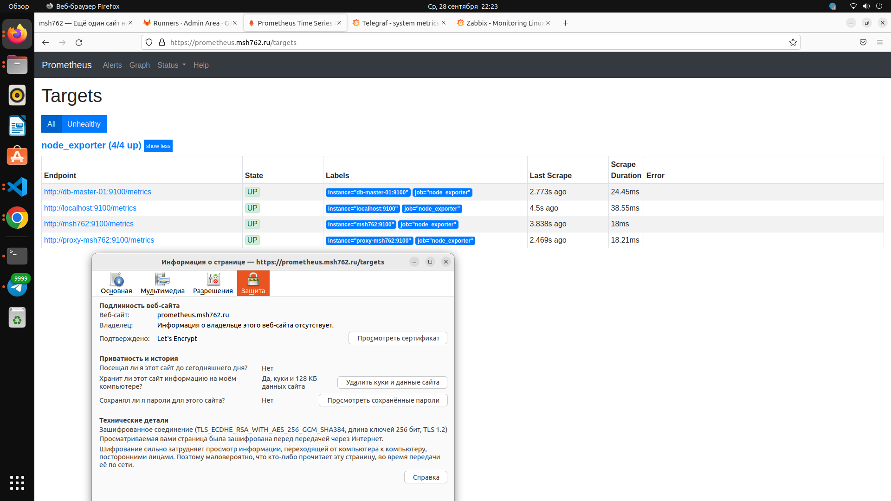

# DevOps-инженер Yandex cloud
## 1.
Вся инфраструктура в YC разварачивается  с помощью [terraform](./project/terraform/)
Структура ДНС-записи выглядить следующим образом 

 Вся привязка осуществляется с помощью [модуля](./project/terraform/modules/yandex_dns_zone/)

Настройки workspace

    terraform workspace list                
    default
    * prod
    stage
Остальные моменты по терраформ можно посмотреть в каталоге с проектом [terraform](./project/terraform/projectA/)

## Ansible в проекте

Данный пункт занимает львиную долу в проекте. 90% проекта это ansible и конфиги для служб
Все файлы относящие к [ansible](./project/ansible/) можно посмотреть в каталоге
### Установка NGINX Cerbot
Мной была написанна роль для установки NGINX как reverse proxy с поддержкой TLS для обеспечения безопасности.
Саму роль можно посмотреть

[reverse proxy](/project/ansible/roles/reverse_proxy/tasks/main.yml)

[certbot](./project/ansible/roles/reverse_proxy/tasks/certbot.yml)

## Настройка кластера MYSQL
Далее была написана роль для настройки и сборке кластера MYSQL, где был 1 master и 1 slave. Ниже можно будет посмотреть вывод команды SHOW SLAVE STATUS\G, а также можно посмотреть роль для настройки и установки данного кластере. Была написана одна роль, для 2-х виртуальных машин, использовалось условие when

    when: inventory_hostname in groups["db-master"]

[Сама роль](./project/ansible/roles/db-all/tasks/main.yml)

Вывод для проверки на slave

SHOW SLAVE STATUS\G

    SHOW SLAVE STATUS\G
    *************************** 1. row ***************************
                Slave_IO_State: Connecting to source
                    Master_Host: db-master-01
                    Master_User: replacation
                    Master_Port: 3306
                    Connect_Retry: 60
                Master_Log_File: binlog.000003
            Read_Master_Log_Pos: 34973
                Relay_Log_File: db-slave-01-relay-bin.000001
                    Relay_Log_Pos: 4
            Relay_Master_Log_File: binlog.000003
                Slave_IO_Running: Connecting
                Slave_SQL_Running: Yes
                Replicate_Do_DB: 
            Replicate_Ignore_DB: 
            Replicate_Do_Table: 
        Replicate_Ignore_Table: 
        Replicate_Wild_Do_Table: 
    Replicate_Wild_Ignore_Table: 
                    Last_Errno: 0
                    Last_Error: 
                    Skip_Counter: 0
            Exec_Master_Log_Pos: 34973
                Relay_Log_Space: 157
                Until_Condition: None
                Until_Log_File: 
                    Until_Log_Pos: 0
            Master_SSL_Allowed: No
            Master_SSL_CA_File: 
            Master_SSL_CA_Path: 
                Master_SSL_Cert: 
                Master_SSL_Cipher: 
                Master_SSL_Key: 
            Seconds_Behind_Master: NULL
    Master_SSL_Verify_Server_Cert: No
                    Last_IO_Errno: 2003
                    Last_IO_Error: error connecting to master 'replacation@db-master-01:3306' - retry-time: 60 retries: 2 message: Can't connect to MySQL server on 'db-master-01:3306' (111)
                Last_SQL_Errno: 0
                Last_SQL_Error: 
    Replicate_Ignore_Server_Ids: 
                Master_Server_Id: 0
                    Master_UUID: 
                Master_Info_File: mysql.slave_master_info
                        SQL_Delay: 0
            SQL_Remaining_Delay: NULL
        Slave_SQL_Running_State: Replica has read all relay log; waiting for more updates
            Master_Retry_Count: 86400
                    Master_Bind: 
        Last_IO_Error_Timestamp: 220827 14:12:09
        Last_SQL_Error_Timestamp: 
                Master_SSL_Crl: 
            Master_SSL_Crlpath: 
            Retrieved_Gtid_Set: 
                Executed_Gtid_Set: 
                    Auto_Position: 0
            Replicate_Rewrite_DB: 
                    Channel_Name: 
            Master_TLS_Version: 
        Master_public_key_path: 
            Get_master_public_key: 0
                Network_Namespace: 
    1 row in set, 1 warning (0.01 sec)

## Установка Wordpress

Для установки и настройки я использовал связку LEMP PHP7.4-FPM NGINX и сам WORDPRESS
Роль для развертывания и установки данных компонентов [тут](./project/ansible/roles/wordpress/tasks/main.yml)

Скриншоты для проверки 
 
 

Сертификат

 

 ## Установка Gitlab and Gitlab Runner

 [Установка Gitlab выполнена с помощью роли](./project/ansible/roles/gitlab/tasks/main.yml)

 [Установка Gitlab Runner выполнена из роли](./project/ansible/roles/runner/tasks/main.yml)

Результат выполнения двух ролей 

Так же мной был написан [pipeline](./.gitlab-ci.yml) CICD 
На скриншоте видно, что CI CD отработал и заменил index.php

## Установка и настройка мониторинга

Ansible роль для установки [Prometheus](./project/ansible/roles/monitoring/tasks/prometheus_i.yml), [Alert Manager](./project/ansible/roles/monitoring/tasks/alertmanager.yml) и [Grafana](./project/ansible/roles/monitoring/tasks/grafana.yml)

Скриншоты работы 
Метрики с reverse proxy

 

Метрики с master db MYSQL

